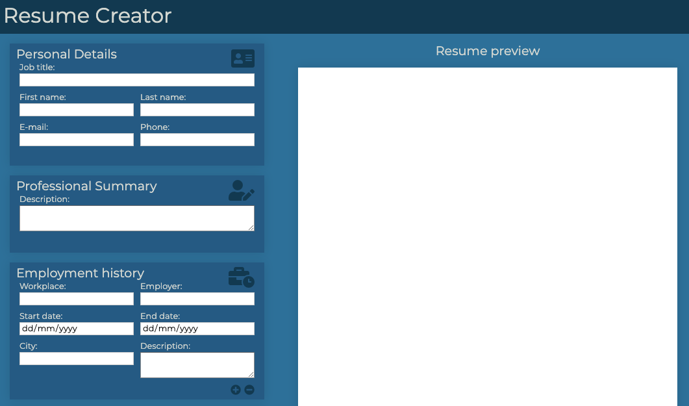

# Resume Creator

> Resume Creator for creating your resume with personal details, professional summary, employment history, education, skills and links to social media or portfolio.

## Table of contents
* [Technologies](#technologies)
* [Setup](#setup)
* [Features](#features)
* [Preview](#preview)
* [Status](#status)
* [Contact](#contact)

## Technologies
* HTML5
* CSS3
* JavaScript ES6
* npm
* gulp

## Setup
If you want to run my website locally, enter the following commands in console:

`npm install -g gulp-cli`

`npm install`

`gulp`

## Features
List of features ready and TODOs for future development
* creating additional inputs by clicking on + button
* deleting unnecessary inputs by clicking on - button
* resume preview with printing option

To-do list:
* improve styles for printing
* ability to change the order of the resume sections
* JavaScript improvements

## Preview
To live preview of my project visit this website: [Resume Creator](https://jakub-matusiak.github.io/resume-creator/)

## Status
Project is _in progress_

## Contact
Created by [Jakub Matusiak](https://github.com/jakub-matusiak) - feel free to contact me!